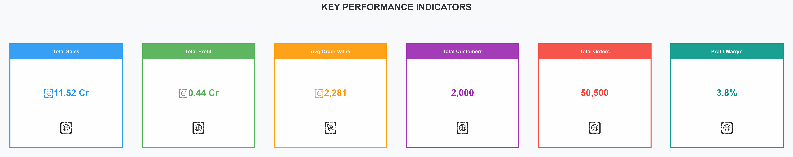
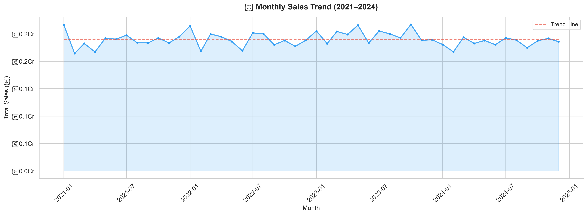
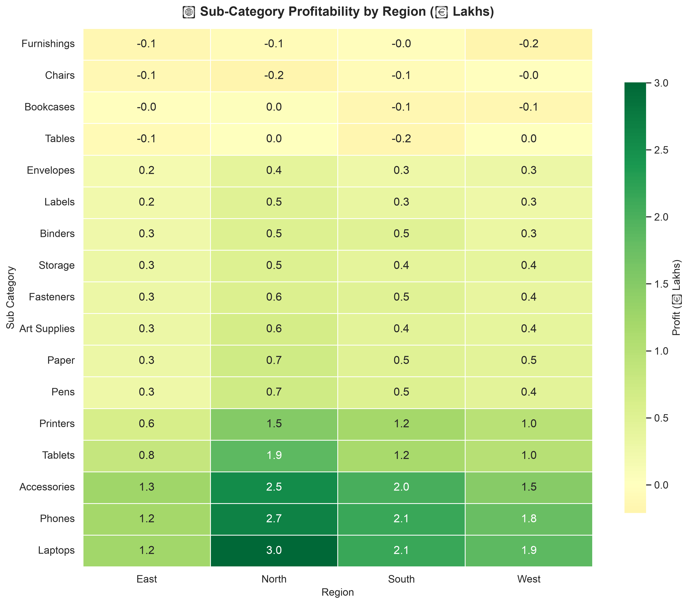
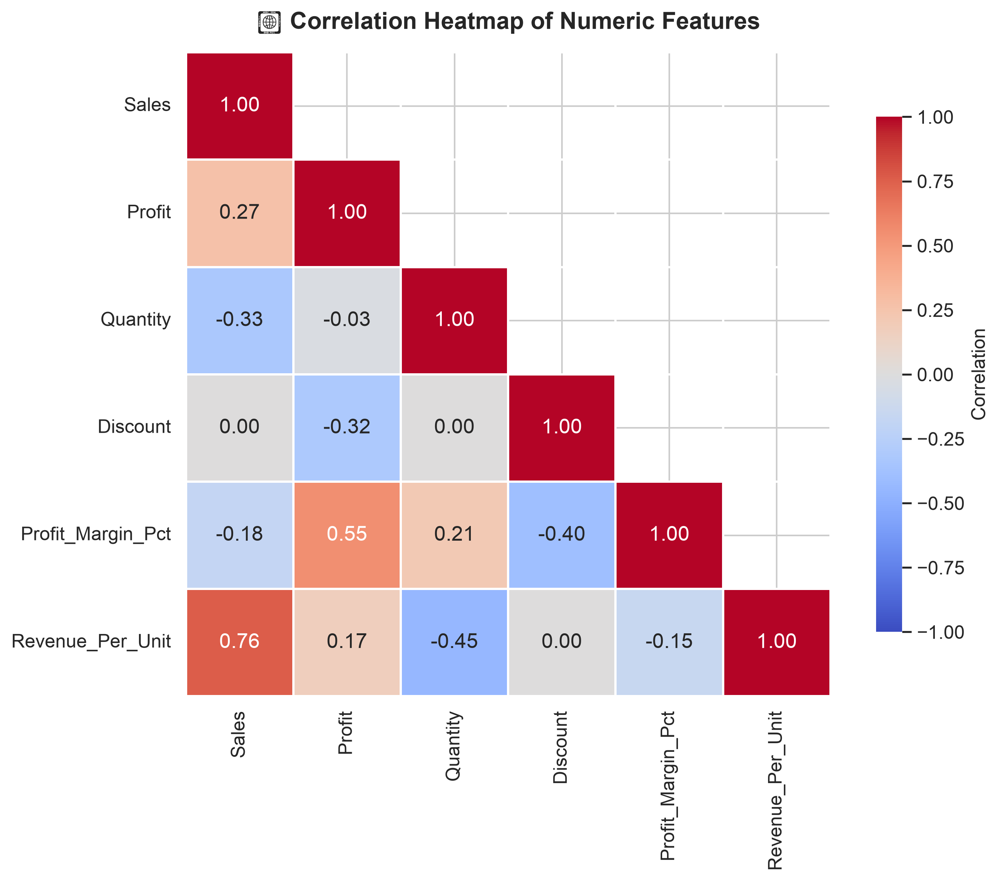

# 📊 Sales Analytics Dashboard

[](https://python.org)
[](https://pandas.pydata.org)
[](https://matplotlib.org)
[](https://seaborn.pydata.org)
[](https://jupyter.org)

> A comprehensive end-to-end Sales Analytics project featuring **50,000+ records** of synthetic Indian e-commerce data, complete EDA, professional visualizations, and actionable business insights.

---

## 🎯 Project Overview

This project demonstrates the complete data analytics lifecycle:

1. **Data Generation** — 50,000+ realistic sales records with 16 columns
2. **Data Cleaning** — Handling missing values, duplicates, and type corrections
3. **Outlier Detection** — IQR-based detection with visual analysis
4. **Feature Engineering** — 10 derived features for deeper insights
5. **KPI Dashboard** — Key business metrics at a glance
6. **17 Professional Visualizations** — Answering 10 critical business questions
7. **Business Recommendations** — Data-driven actionable insights

---

## 🗂️ Folder Structure

```
Sales_Analytics_Project/
│
├── 📁 Dataset/
│   ├── sales_data.csv                 # Raw generated dataset (50,000+ rows)
│   └── sales_data_cleaned.csv         # Cleaned & feature-engineered dataset
│
├── 📁 Notebook/
│   └── Sales_Analytics.ipynb          # Complete analysis notebook
│
├── 📁 Images/
│   ├── 01_outliers_before.png
│   ├── 02_kpi_cards.png
│   ├── 03_top_products_revenue.png
│   ├── 04_top_products_quantity.png
│   ├── 05_profit_by_category.png
│   ├── 06_monthly_sales_trend.png
│   ├── 07_statewise_sales.png
│   ├── 08_regionwise_profit.png
│   ├── 09_top_customers.png
│   ├── 10_loss_making_products.png
│   ├── 11_sales_vs_profit.png
│   ├── 12_discount_impact.png
│   ├── 13_category_contribution.png
│   ├── 14_subcategory_heatmap.png
│   ├── 15_quarterly_revenue.png
│   ├── 16_payment_mode.png
│   ├── 17_ship_mode_profit.png
│   ├── 18_profit_margin_distribution.png
│   └── 19_correlation_heatmap.png
│
├── 📄 README.md                       # This file
└── 📄 requirements.txt               # Python dependencies
```

---

## 📋 Dataset Description

| Column | Type | Description |
|--------|------|-------------|
| `Order ID` | String | Unique order identifier (ORD-00001 to ORD-50500) |
| `Order Date` | Date | Order date (2021-01-01 to 2024-12-31) |
| `Customer Name` | String | Customer full name (~2,000 unique) |
| `Customer ID` | String | Unique customer ID (CUST-0001 to CUST-2000) |
| `State` | String | Indian state (29 states) |
| `City` | String | City within the state |
| `Category` | String | Product category (Technology, Furniture, Office Supplies) |
| `Sub Category` | String | Product sub-category (17 types) |
| `Product Name` | String | Specific product name (~200 unique) |
| `Sales` | Float | Order sales amount (₹) |
| `Profit` | Float | Order profit/loss (₹) |
| `Quantity` | Integer | Units ordered |
| `Discount` | Float | Discount applied (0% – 30%) |
| `Region` | String | Geographic region (North, South, East, West) |
| `Payment Mode` | String | Payment method (COD, Online, Cards) |
| `Ship Mode` | String | Shipping class (Standard, Second, First, Same Day) |

---

## 🔑 Key Findings

### KPI Highlights
| Metric | Value |
|--------|-------|
| 📊 Total Records | 50,000+ |
| 🏪 Total Customers | ~2,000 |
| 📦 Product Categories | 3 |
| 🗓️ Time Period | 2021 – 2024 |
| 🌍 States Covered | 29 |

### Business Insights

- 🏆 **Technology** drives the highest revenue; **Office Supplies** is the profit engine
- ⚠️ **Discounts > 20%** consistently destroy profitability
- 📈 **Q4 (Oct–Dec)** is the peak sales season every year
- 🌍 **West & South** regions outperform in profitability
- 🪑 **Furniture** (Bookcases, Tables) is the most loss-prone category
- 💳 **Online payments** account for ~45% of all transactions

---

## 📊 Sample Visualizations

### KPI Dashboard Cards


### Monthly Sales Trend


### Sub-Category Profitability Heatmap


### Correlation Analysis


---

## 🛠️ Tech Stack

| Tool | Purpose |
|------|---------|
| **Python 3.10+** | Programming language |
| **Pandas** | Data manipulation & analysis |
| **NumPy** | Numerical operations |
| **Matplotlib** | Static visualizations |
| **Seaborn** | Statistical visualizations |
| **Jupyter Notebook** | Interactive analysis environment |

---

## 🚀 How to Run

### 1. Clone the Repository
```bash
git clone https://github.com/yourusername/Sales_Analytics_Project.git
cd Sales_Analytics_Project
```

### 2. Set Up Environment
```bash
python3 -m venv .venv
source .venv/bin/activate        # macOS/Linux
# .venv\Scripts\activate         # Windows

pip install -r requirements.txt
```

### 3. Launch Jupyter Notebook
```bash
jupyter notebook Notebook/Sales_Analytics.ipynb
```

### 4. Run All Cells
Execute all cells sequentially (Kernel → Restart & Run All). The notebook will:
- Generate the synthetic dataset in `Dataset/`
- Perform all cleaning and analysis
- Save 17+ visualizations to `Images/`

---

## 📈 Business Questions Answered

| # | Question | Visualization |
|---|----------|---------------|
| 1 | Best Selling Products (Revenue) | Horizontal Bar Chart |
| 2 | Best Selling Products (Quantity) | Horizontal Bar Chart |
| 3 | Highest Profit Category | Grouped Bar Chart |
| 4 | Monthly Sales Trend | Line Chart with Trend |
| 5 | State-wise Sales | Horizontal Bar Chart |
| 6 | Region-wise Profit | Donut Chart |
| 7 | Top Customers | Horizontal Bar Chart |
| 8 | Loss-Making Products | Horizontal Bar Chart |
| 9 | Sales vs Profit Relationship | Scatter Plot |
| 10 | Discount Impact on Profit | Box Plot + Bar Chart |

---

## 👤 Author

**Sujal Giri**

- 🔗 [GitHub](https://github.com/sujalgiri)
- 📧 Contact: [Your Email]

---

## 📄 License

This project is open source and available under the [MIT License](LICENSE).

---

<p align="center">
  <b>⭐ If you found this project useful, please consider giving it a star! ⭐</b>
</p>
